---
# Front matter
lang: ru-RU
title: "Отчет по лабораторной работе №1"
subtitle: "Информационная безопасность"
author: "Паландузян АК НПИбд-01-18"

# Formatting
toc-title: "Содержание"
toc: true # Table of contents
toc_depth: 2
lof: true # List of figures
fontsize: 12pt
linestretch: 1.5
papersize: a4paper
documentclass: scrreprt
polyglossia-lang: russian
polyglossia-otherlangs: english
mainfont: PT Serif
romanfont: PT Serif
sansfont: PT Sans
monofont: PT Mono
mainfontoptions: Ligatures=TeX
romanfontoptions: Ligatures=TeX
sansfontoptions: Ligatures=TeX,Scale=MatchLowercase
monofontoptions: Scale=MatchLowercase
indent: true
pdf-engine: lualatex
header-includes:
  - \linepenalty=10 # the penalty added to the badness of each line within a paragraph (no associated penalty node) Increasing the υalue makes tex try to haυe fewer lines in the paragraph.
  - \interlinepenalty=0 # υalue of the penalty (node) added after each line of a paragraph.
  - \hyphenpenalty=50 # the penalty for line breaking at an automatically inserted hyphen
  - \exhyphenpenalty=50 # the penalty for line breaking at an explicit hyphen
  - \binoppenalty=700 # the penalty for breaking a line at a binary operator
  - \relpenalty=500 # the penalty for breaking a line at a relation
  - \clubpenalty=150 # extra penalty for breaking after first line of a paragraph
  - \widowpenalty=150 # extra penalty for breaking before last line of a paragraph
  - \displaywidowpenalty=50 # extra penalty for breaking before last line before a display math
  - \brokenpenalty=100 # extra penalty for page breaking after a hyphenated line
  - \predisplaypenalty=10000 # penalty for breaking before a display
  - \postdisplaypenalty=0 # penalty for breaking after a display
  - \floatingpenalty = 20000 # penalty for splitting an insertion (can only be split footnote in standard LaTeX)
  - \raggedbottom # or \flushbottom
  - \usepackage{float} # keep figures where there are in the text
  - \usepackage{amsmath}
  - \floatplacement{figure}{H} # keep figures where there are in the text
---

# Цель работы

Приобретение практических навыков установки операционной системы на виртуальную машину, настройки минимально необходимых для
дальнейшей работы сервисов.

# Задание

Установить и настроить CentOS на виртуальной машине на базе VirtualBox.

# Выполнение лабораторной работы

1. Создал новую виртуальную машину. Для этого в VirtualBox выбрал: Машина → Создать.
Указал имя виртуальной машины и тип операционной системы. Указал размер основной памяти виртуальной машины

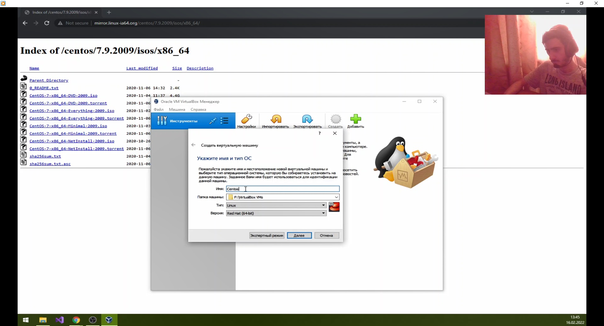

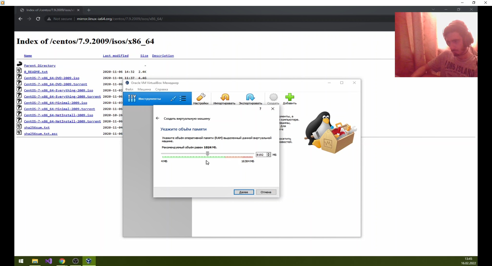

2. Задал конфигурацию жёсткого диска — загрузочный, VDI (VirtualBox Disk Image), динамический виртуальный диск.

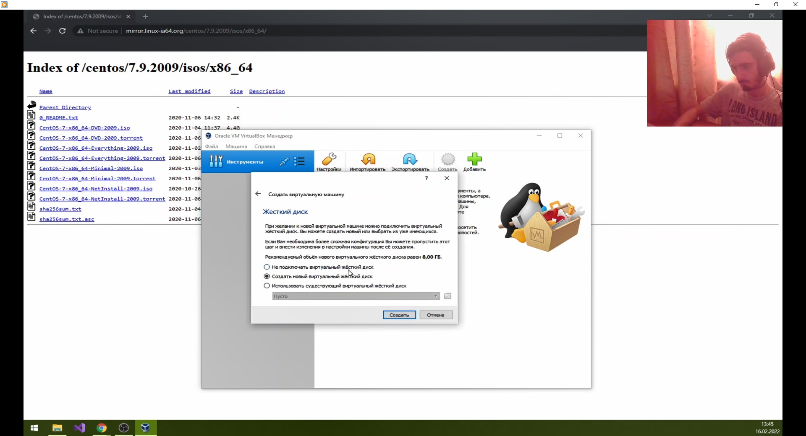

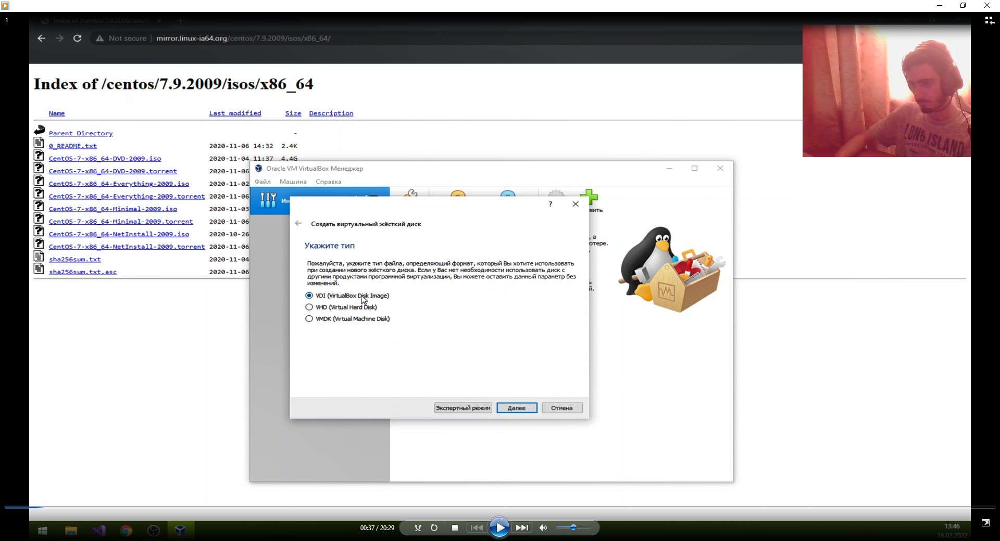

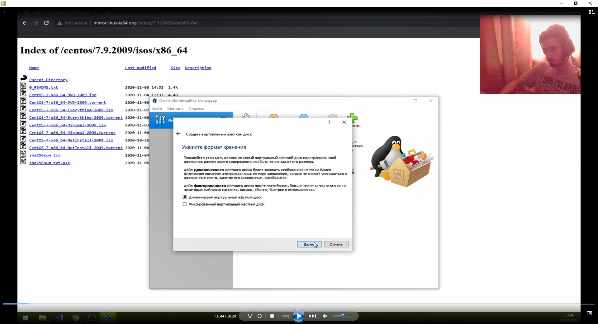

3. Задал размер диска и его расположение. 

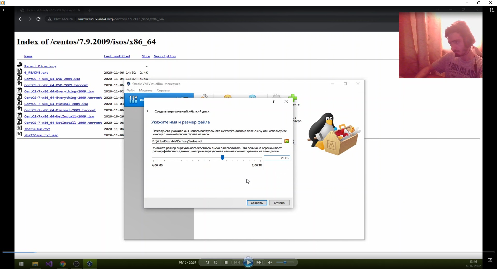

4. Настроил технические характеристики машины под себя, выделил нужное количество ядер и видеопамяти
Добавил новый привод оптических дисков и выбрал образ. 

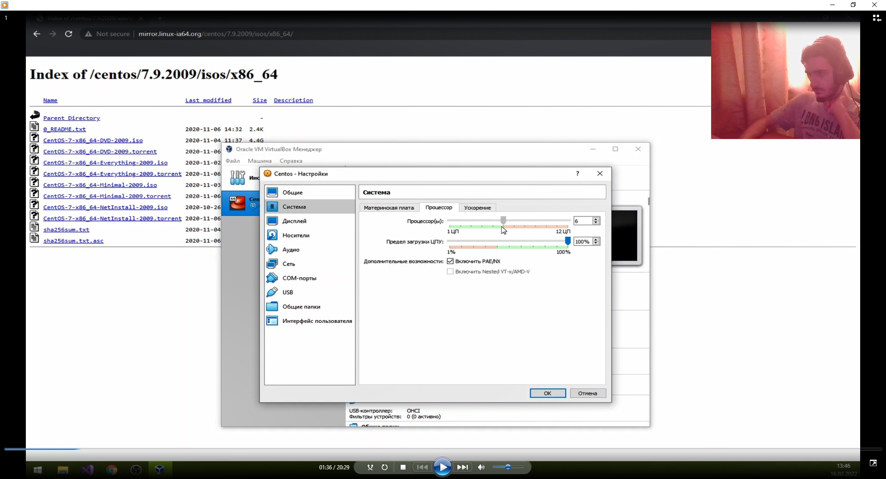

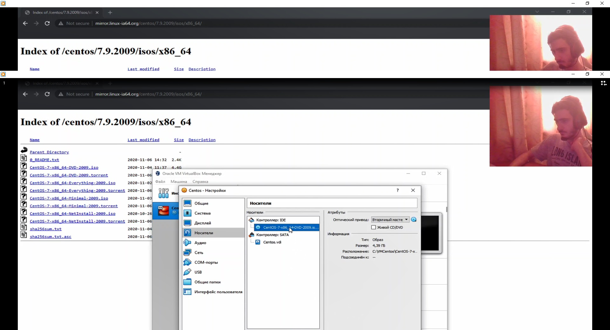

5. Запустил виртуальную машину, выбрал установку системы на жёсткий диск. 

6. Установил русский язык для интерфейса и раскладки клавиатуры. 

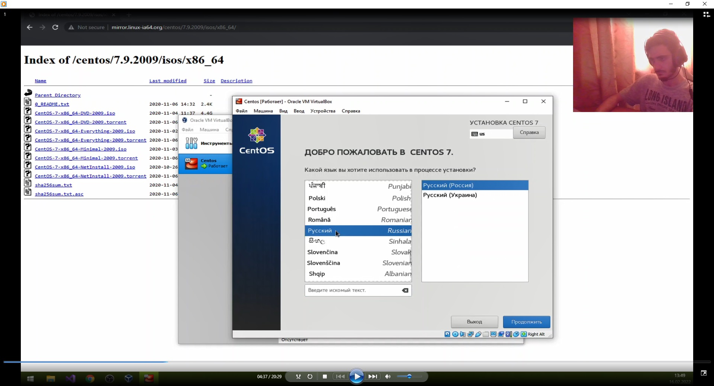

7. В качестве имени машины указал "akpalanduzyan.localdomain". Указал часовой пояс «Москва». Провел первичную настройку.

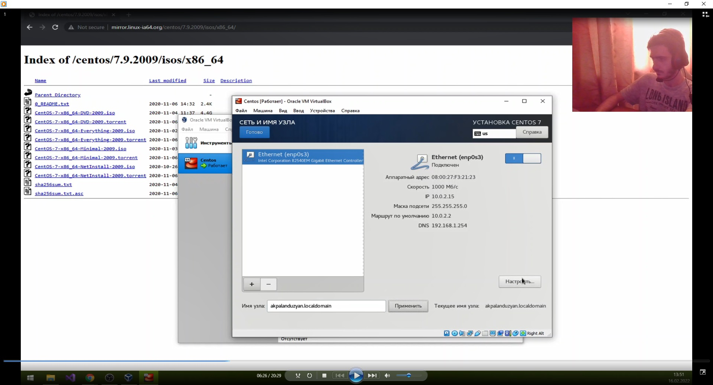

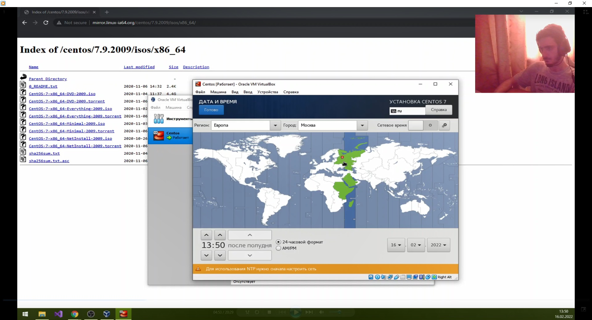

8. Установил пароль для root.

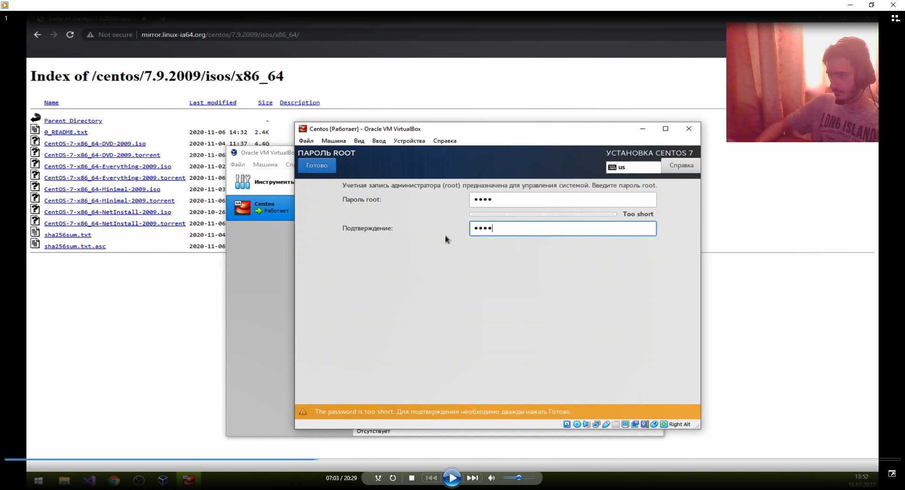

9. Создал пользователя akpalanduzyan.

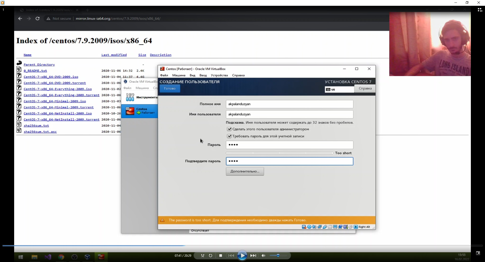

10. Завершил установку операционной системы и перезагрузил её, а также установил образ для работы с гостевой системой.

# Выводы
На основе проделанной работы я приобрел практические навыки установки операционной системы на виртуальную машину, настройки минимально необходимых для дальнейшей работы сервисов.