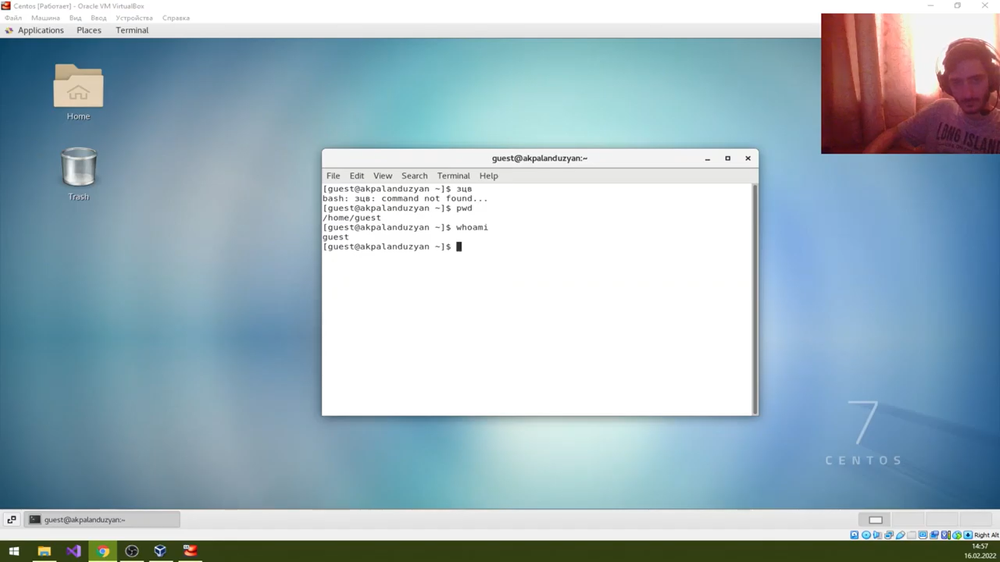
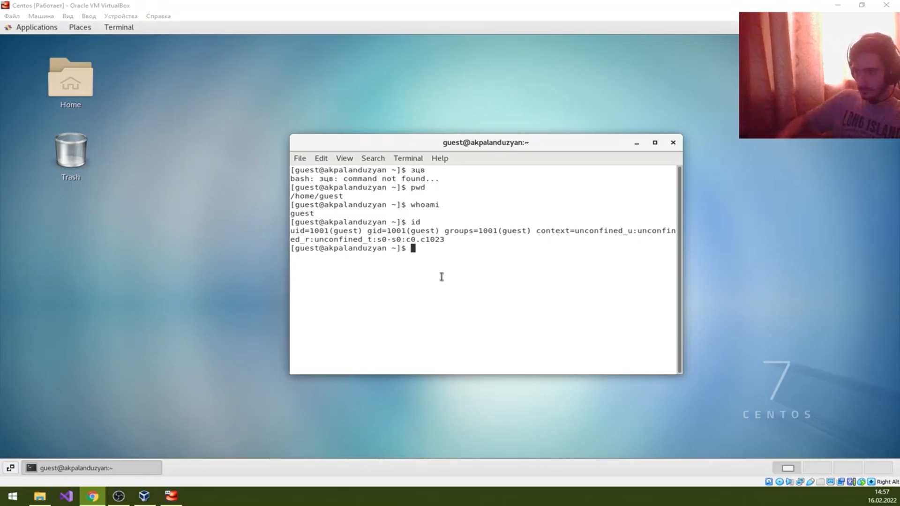

---
# Front matter
lang: ru-RU
title: "Отчет по лабораторной работе №2"
subtitle: "Информационная безопасность"
author: "Паландузян АК НПИбд-01-18"

# Formatting
toc-title: "Содержание"
toc: true # Table of contents
toc_depth: 2
lof: true # List of figures
fontsize: 12pt
linestretch: 1.5
papersize: a4paper
documentclass: scrreprt
polyglossia-lang: russian
polyglossia-otherlangs: english
mainfont: PT Serif
romanfont: PT Serif
sansfont: PT Sans
monofont: PT Mono
mainfontoptions: Ligatures=TeX
romanfontoptions: Ligatures=TeX
sansfontoptions: Ligatures=TeX,Scale=MatchLowercase
monofontoptions: Scale=MatchLowercase
indent: true
pdf-engine: lualatex
header-includes:
  - \linepenalty=10 # the penalty added to the badness of each line within a paragraph (no associated penalty node) Increasing the υalue makes tex try to haυe fewer lines in the paragraph.
  - \interlinepenalty=0 # υalue of the penalty (node) added after each line of a paragraph.
  - \hyphenpenalty=50 # the penalty for line breaking at an automatically inserted hyphen
  - \exhyphenpenalty=50 # the penalty for line breaking at an explicit hyphen
  - \binoppenalty=700 # the penalty for breaking a line at a binary operator
  - \relpenalty=500 # the penalty for breaking a line at a relation
  - \clubpenalty=150 # extra penalty for breaking after first line of a paragraph
  - \widowpenalty=150 # extra penalty for breaking before last line of a paragraph
  - \displaywidowpenalty=50 # extra penalty for breaking before last line before a display math
  - \brokenpenalty=100 # extra penalty for page breaking after a hyphenated line
  - \predisplaypenalty=10000 # penalty for breaking before a display
  - \postdisplaypenalty=0 # penalty for breaking after a display
  - \floatingpenalty = 20000 # penalty for splitting an insertion (can only be split footnote in standard LaTeX)
  - \raggedbottom # or \flushbottom
  - \usepackage{float} # keep figures where there are in the text
  - \usepackage{amsmath}
  - \floatplacement{figure}{H} # keep figures where there are in the text
---

# Цель работы

Получить практические навыки работы в консоли с атрибутами файлов, закрепить теоретические основы дискреционного разграничения доступа в современных системах с открытым кодом на базе ОС Linux.

# Выполнение лабораторной работы

1.  Создаю пользователя guest через суперпользователя. 

2. Перехожу в систему от guest. Помимо пособа через интерфейс можно переключиться на него через sudo - guest.

3. Через pwd проверяю директорию. Она домашняя. Проверяю имя пользователя. 

4. Проверяю имя и группы пользователя. Uid, gid и остальные значения совпадают с тем, что выводит groups. 

5. Открываю /etc/passwd, данные в gid и uid такие же, как в предыдущих командах.

6. Проверяем директорию с домашними каталогами пользователей. Поддиректории не открываются, на директориях для владельца установлены права на чтение, исполнение и запись, у пользователей групп и остальных пользователей прав нет.

7. Выводим доп атрибуты поддиректорий в home.
У нас нет доступа к такой информации от guest.

8. Создаем dir1.
Проверяем права доступа и расширенные атрибуты dir1.

9. Снимаю с dir1 все атрибуты и вывел их.

10. Пробуем создать файл, получаем отказ из-за отсутствия атрибутов.

11. Для заполненяи таблицы выполняю команды от имени владельца директории, при этом перебирая разные коды доступа. Плюсом отмечены разрешенные операции, а минусом — неуспешные.

| Права директории | Права файла | Создание файла | Удаление файла | Запись в файл | Чтение файла | Смена директории | Просмотр файлов в директории | Переименование файла | Смена атрибутов файла |
|------------------|-------------|----------------|----------------|---------------|--------------|------------------|------------------------------|----------------------|-----------------------|
| d--- (000)        | --- (000)   | -              | -              | -             | -            | -                | -                            | -                    | -                     |
| d--- (000)        | --x (100)   | -              | -              | -             | -            | -                | -                            | -                    | -                     |
| d--- (000)        | -w- (200)   | -              | -              | -             | -            | -                | -                            | -                    | -                     |
| d--- (000)        | -wx (300)   | -              | -              | -             | -            | -                | -                            | -                    | -                     |
| d--- (000)        | r-- (400)   | -              | -              | -             | -            | -                | -                            | -                    | -                     |
| d--- (000)        | r-x (500)   | -              | -              | -             | -            | -                | -                            | -                    | -                     |
| d--- (000)        | rw- (600)   | -              | -              | -             | -            | -                | -                            | -                    | -                     |
| d--- (000)        | rwx (700)   | -              | -              | -             | -            | -                | -                            | -                    | -                     |
| d--x (100)        | --- (000)   | -              | -              | -             | -            | +                | -                            | -                    | +                     |
| d--x (100)        | --x (100)   | -              | -              | -             | -            | +                | -                            | -                    | +                     |
| d--x (100)        | -w- (200)   | -              | -              | +             | -            | +                | -                            | -                    | +                     |
| d--x (100)        | -wx (300)   | -              | -              | +             | -            | +                | -                            | -                    | +                     |
| d--x (100)        | r-- (400)   | -              | -              | -             | +            | +                | -                            | -                    | +                     |
| d--x (100)        | r-x (500)   | -              | -              | -             | +            | +                | -                            | -                    | +                     |
| d--x (100)        | rw- (600)   | -              | -              | +             | +            | +                | -                            | -                    | +                     |
| d--x (100)        | rwx (700)   | -              | -              | +             | +            | +                | -                            | -                    | +                     |
| d-w- (200)        | --- (000)   | -              | -              | -             | -            | -                | -                            | -                    | -                     |
| d-w- (200)        | --x (100)   | -              | -              | -             | -            | -                | -                            | -                    | -                     |
| d-w- (200)        | -w- (200)   | -              | -              | -             | -            | -                | -                            | -                    | -                     |
| d-w- (200)        | -wx (300)   | -              | -              | -             | -            | -                | -                            | -                    | -                     |
| d-w- (200)        | r-- (400)   | -              | -              | -             | -            | -                | -                            | -                    | -                     |
| d-w- (200)        | r-x (500)   | -              | -              | -             | -            | -                | -                            | -                    | -                     |
| d-w- (200)        | rw- (600)   | -              | -              | -             | -            | -                | -                            | -                    | -                     |
| d-w- (200)        | rwx (700)   | -              | -              | -             | -            | -                | -                            | -                    | -                     |
| d-wx (300)        | --- (000)   | +              | +              | -             | -            | +                | -                            | +                    | +                     |
| d-wx (300)        | --x (100)   | +              | +              | -             | -            | +                | -                            | +                    | +                     |
| d-wx (300)        | -w- (200)   | +              | +              | +             | -            | +                | -                            | +                    | +                     |
| d-wx (300)        | -wx (300)   | +              | +              | +             | -            | +                | -                            | +                    | +                     |
| d-wx (300)        | r-- (400)   | +              | +              | -             | +            | +                | -                            | +                    | +                     |
| d-wx (300)        | r-x (500)   | +              | +              | -             | +            | +                | -                            | +                    | +                     |
| d-wx (300)        | rw- (600)   | +              | +              | +             | +            | +                | -                            | +                    | +                     |
| d-wx (300)        | rwx (700)   | +              | +              | +             | +            | +                | -                            | +                    | +                     |
| dr-- (400)        | --- (000)   | -              | -              | -             | -            | -                | +                            | -                    | -                     |
| dr-- (400)        | --x (100)   | -              | -              | -             | -            | -                | +                            | -                    | -                     |
| dr-- (400)        | -w- (200)   | -              | -              | -             | -            | -                | +                            | -                    | -                     |
| dr-- (400)        | -wx (300)   | -              | -              | -             | -            | -                | +                            | -                    | -                     |
| dr-- (400)        | r-- (400)   | -              | -              | -             | -            | -                | +                            | -                    | -                     |
| dr-- (400)        | r-x (500)   | -              | -              | -             | -            | -                | +                            | -                    | -                     |
| dr-- (400)        | rw- (600)   | -              | -              | -             | -            | -                | +                            | -                    | -                     |
| dr-- (400)        | rwx (700)   | -              | -              | -             | -            | -                | +                            | -                    | -                     |
| dr-x (500)        | --- (000)   | -              | -              | -             | -            | +                | +                            | -                    | +                     |
| dr-x (500)        | --x (100)   | -              | -              | -             | -            | +                | +                            | -                    | +                     |
| dr-x (500)        | -w- (200)   | -              | -              | +             | -            | +                | +                            | -                    | +                     |
| dr-x (500)        | -wx (300)   | -              | -              | +             | -            | +                | +                            | -                    | +                     |
| dr-x (500)        | r-- (400)   | -              | -              | -             | +            | +                | +                            | -                    | +                     |
| dr-x (500)        | r-x (500)   | -              | -              | -             | +            | +                | +                            | -                    | +                     |
| dr-x (500)        | rw- (600)   | -              | -              | +             | +            | +                | +                            | -                    | +                     |
| dr-x (500)        | rwx (700)   | -              | -              | +             | +            | +                | +                            | -                    | +                     |
| drw- (600)        | --- (000)   | -              | -              | -             | -            | -                | +                            | -                    | -                     |
| drw- (600)        | --x (100)   | -              | -              | -             | -            | -                | +                            | -                    | -                     |
| drw- (600)        | -w- (200)   | -              | -              | -             | -            | -                | +                            | -                    | -                     |
| drw- (600)        | -wx (300)   | -              | -              | -             | -            | -                | +                            | -                    | -                     |
| drw- (600)        | r-- (400)   | -              | -              | -             | -            | -                | +                            | -                    | -                     |
| drw- (600)        | r-x (500)   | -              | -              | -             | -            | -                | +                            | -                    | -                     |
| drw- (600)        | rw- (600)   | -              | -              | -             | -            | -                | +                            | -                    | -                     |
| drw- (600)        | rwx (700)   | -              | -              | -             | -            | -                | +                            | -                    | -                     |
| drwx (700)        | --- (000)   | +              | +              | -             | -            | +                | +                            | +                    | +                     |
| drwx (700)        | --x (100)   | +              | +              | -             | -            | +                | +                            | +                    | +                     |
| drwx (700)        | -w- (200)   | +              | +              | +             | -            | +                | +                            | +                    | +                     |
| drwx (700)        | -wx (300)   | +              | +              | +             | -            | +                | +                            | +                    | +                     |
| drwx (700)        | r-- (400)   | +              | +              | -             | +            | +                | +                            | +                    | +                     |
| drwx (700)        | r-x (500)   | +              | +              | -             | +            | +                | +                            | +                    | +                     |
| drwx (700)        | rw- (600)   | +              | +              | +             | +            | +                | +                            | +                    | +                     |
| drwx (700)        | rwx (700)   | +              | +              | +             | +            | +  

12. Заполним таблицу минимальных требований для определенных действий:

| Операция               | Мин права на директорию | Мин права на файл |
|------------------------|---------------------------------|---------------------------|
| Создание файла         | -wx (300)                       | --- (000)                 |
| Удаление файла         | -wx (300)                       | --- (000)                 |
| Чтение файла           | --x (100)                       | r-- (400)                 |
| Запись в файл          | --x (100)                       | -w- (200)                 |
| Переименование файла   | -wx (300)                       | --- (000)                 |
| Создание поддиректории | -wx (300)                       | --- (000)                 |
| Удаление поддиректории | -wx (300)                       | --- (000)                 |

# Выводы
Получил практические навыки работы в консоли с атрибутами файлов, закрепил теоретические основы дискреционного разграничения доступа в современных системах с открытым кодом на базе ОС Linux.