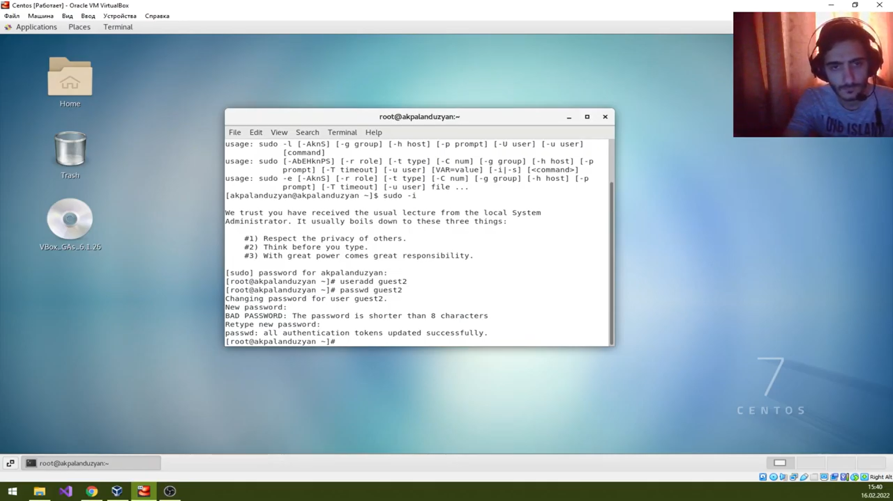
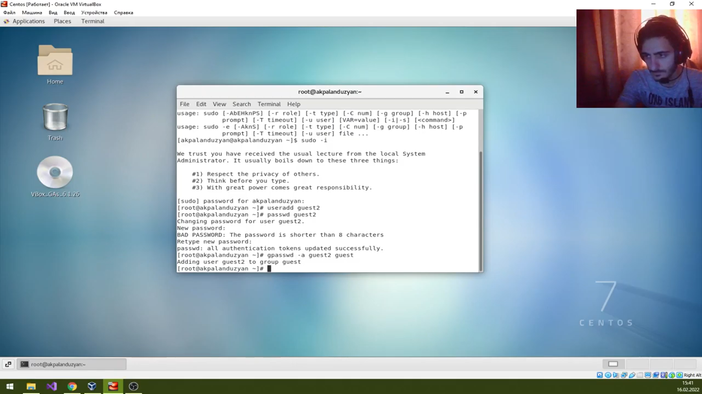
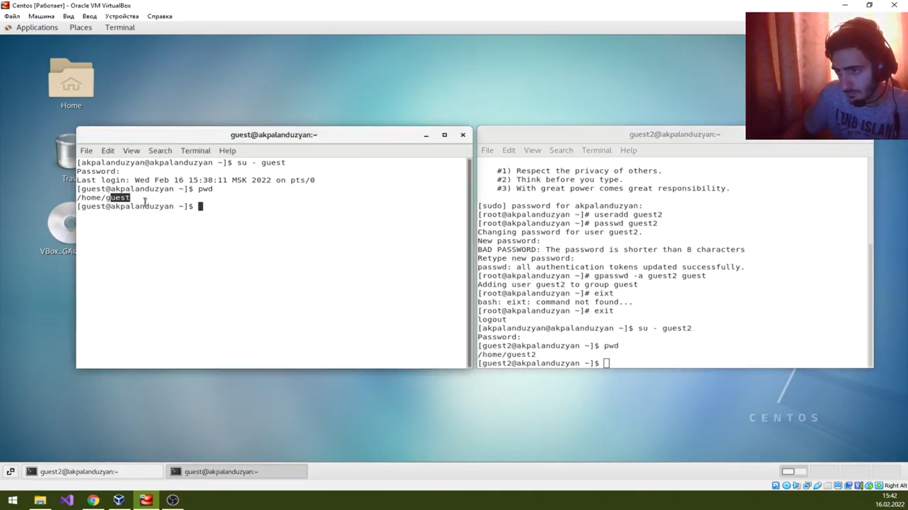
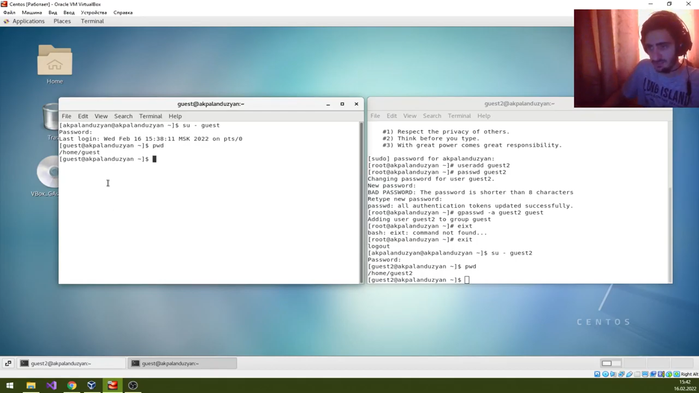
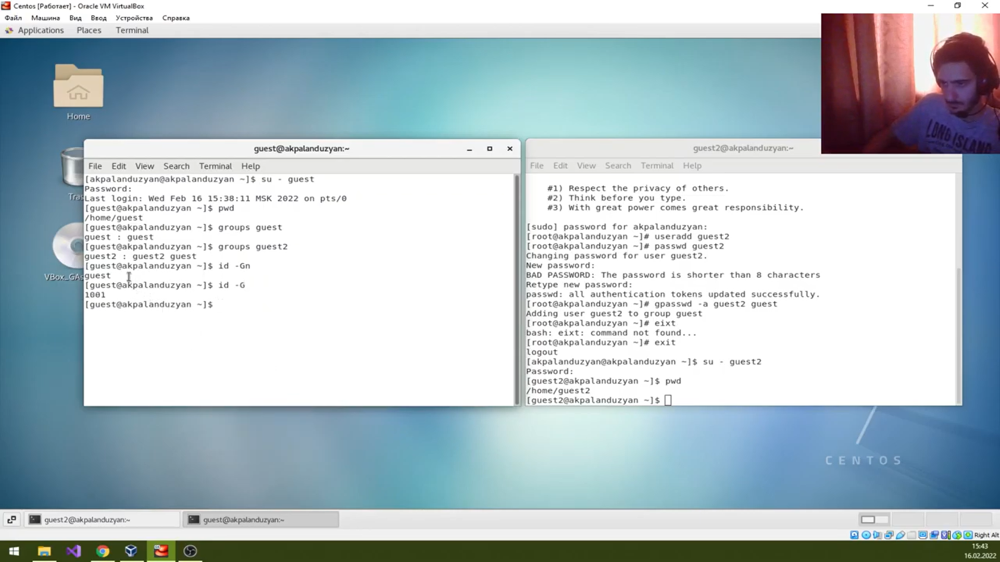
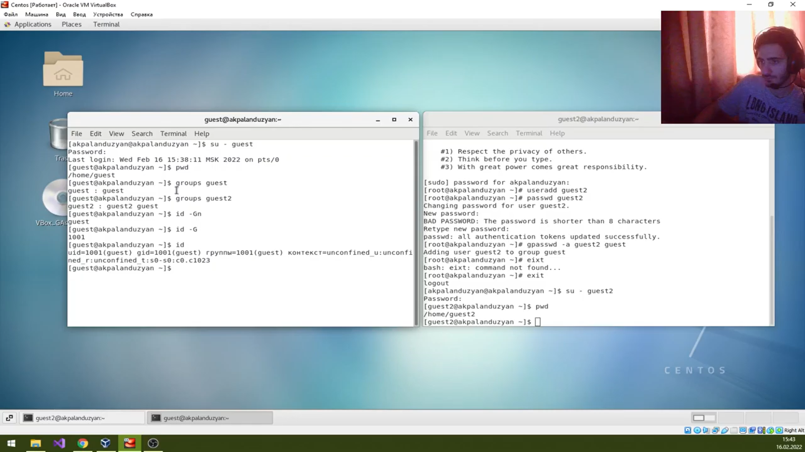
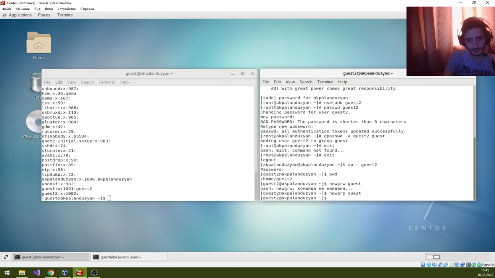
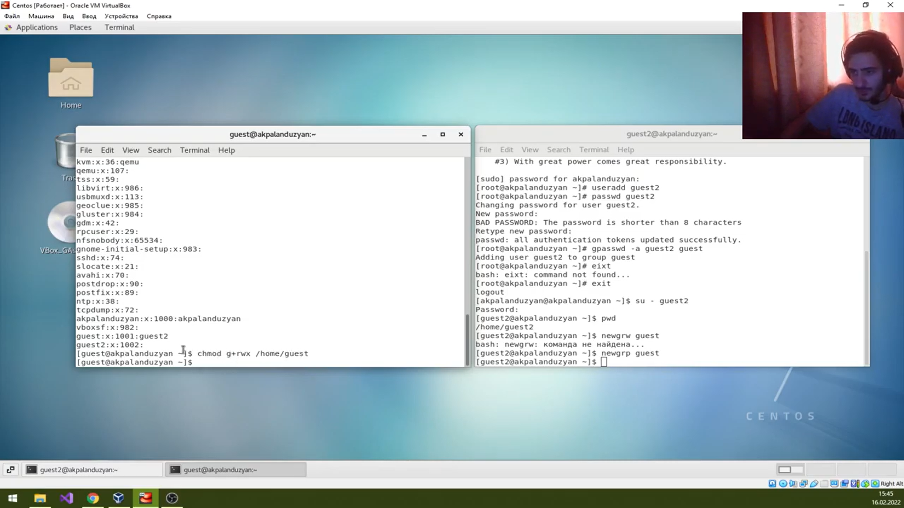
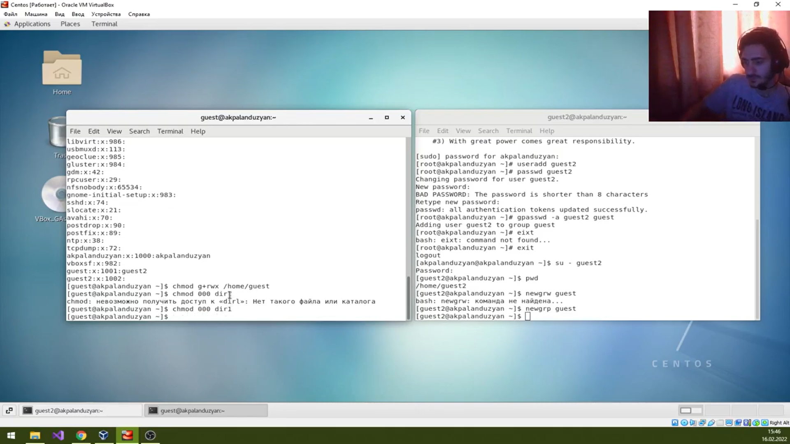

---
# Front matter
lang: ru-RU
title: "Отчет по лабораторной работе №3"
subtitle: "Информационная безопасность"
author: "Паландузян АК НПИбд-01-18"

# Formatting
toc-title: "Содержание"
toc: true # Table of contents
toc_depth: 2
lof: true # List of figures
lot: true # List of tables
fontsize: 12pt
linestretch: 1.5
papersize: a4paper
documentclass: scrreprt
polyglossia-lang: russian
polyglossia-otherlangs: english
mainfont: PT Serif
romanfont: PT Serif
sansfont: PT Sans
monofont: PT Mono
mainfontoptions: Ligatures=TeX
romanfontoptions: Ligatures=TeX
sansfontoptions: Ligatures=TeX,Scale=MatchLowercase
monofontoptions: Scale=MatchLowercase
indent: true
pdf-engine: lualatex
header-includes:
  - \linepenalty=10 # the penalty added to the badness of each line within a paragraph (no associated penalty node) Increasing the υalue makes tex try to haυe fewer lines in the paragraph.
  - \interlinepenalty=0 # υalue of the penalty (node) added after each line of a paragraph.
  - \hyphenpenalty=50 # the penalty for line breaking at an automatically inserted hyphen
  - \exhyphenpenalty=50 # the penalty for line breaking at an explicit hyphen
  - \binoppenalty=700 # the penalty for breaking a line at a binary operator
  - \relpenalty=500 # the penalty for breaking a line at a relation
  - \clubpenalty=150 # extra penalty for breaking after first line of a paragraph
  - \widowpenalty=150 # extra penalty for breaking before last line of a paragraph
  - \displaywidowpenalty=50 # extra penalty for breaking before last line before a display math
  - \brokenpenalty=100 # extra penalty for page breaking after a hyphenated line
  - \predisplaypenalty=10000 # penalty for breaking before a display
  - \postdisplaypenalty=0 # penalty for breaking after a display
  - \floatingpenalty = 20000 # penalty for splitting an insertion (can only be split footnote in standard LaTeX)
  - \raggedbottom # or \flushbottom
  - \usepackage{float} # keep figures where there are in the text
  - \usepackage{amsmath}
  - \floatplacement{figure}{H} # keep figures where there are in the text
---

# Цель работы

Получить практические навыки работы в консоли с атрибутами файлов для групп пользователей.

# Выполнение лабораторной работы

1. Guest уже был создан ранее, создаю guest2.

2. Добавляем guest2 в группу guest. 

3. Зашел в двух разных консолях в guest и guest2, проверил директорию через pwd.

4. Проверил данные пользователей и их групп. Вывод при разных командах совпадает. 

5. В файле /etc/group всё точно так же.

6. От guest2 зарегистрировался в группе guest.

7. От guest изменил права директории /home/guest, разрешив все действия для пользователей группы, т.е. в том числе для пользователя guest2. 

8. Снимаем все атрибуты с /home/guest/dir1 от guest

9. Таблица «Установленные права и разрешенные действия для групп» заполнялась аналогично таблце в предыдущей лабораторной работе:

| Права директории | Права файла | Создание файла | Удаление файла | Запись в файл | Чтение файла | Смена директории | Просмотр файлов в директории | Переименование файла | Смена атрибутов файла |
|------------------|-------------|----------------|----------------|---------------|--------------|------------------|------------------------------|----------------------|-----------------------|
| d--- (000)        | --- (000)   | -              | -              | -             | -            | -                | -                            | -                    | -                     |
| d--- (000)        | --x (010)   | -              | -              | -             | -            | -                | -                            | -                    | -                     |
| d--- (000)        | -w- (020)   | -              | -              | -             | -            | -                | -                            | -                    | -                     |
| d--- (000)        | -wx (030)   | -              | -              | -             | -            | -                | -                            | -                    | -                     |
| d--- (000)        | r-- (040)   | -              | -              | -             | -            | -                | -                            | -                    | -                     |
| d--- (000)        | r-x (050)   | -              | -              | -             | -            | -                | -                            | -                    | -                     |
| d--- (000)        | rw- (060)   | -              | -              | -             | -            | -                | -                            | -                    | -                     |
| d--- (000)        | rwx (070)   | -              | -              | -             | -            | -                | -                            | -                    | -                     |
| d--x (010)        | --- (000)   | -              | -              | -             | -            | +                | -                            | -                    | -                     |
| d--x (010)        | --x (010)   | -              | -              | -             | -            | +                | -                            | -                    | -                     |
| d--x (010)        | -w- (020)   | -              | -              | +             | -            | +                | -                            | -                    | -                     |
| d--x (010)        | -wx (030)   | -              | -              | +             | -            | +                | -                            | -                    | -                     |
| d--x (010)        | r-- (040)   | -              | -              | -             | +            | +                | -                            | -                    | -                     |
| d--x (010)        | r-x (050)   | -              | -              | -             | +            | +                | -                            | -                    | -                     |
| d--x (010)        | rw- (060)   | -              | -              | +             | +            | +                | -                            | -                    | -                     |
| d--x (010)        | rwx (070)   | -              | -              | +             | +            | +                | -                            | -                    | -                     |
| d-w- (020)        | --- (000)   | -              | -              | -             | -            | -                | -                            | -                    | -                     |
| d-w- (020)        | --x (010)   | -              | -              | -             | -            | -                | -                            | -                    | -                     |
| d-w- (020)        | -w- (020)   | -              | -              | -             | -            | -                | -                            | -                    | -                     |
| d-w- (020)        | -wx (030)   | -              | -              | -             | -            | -                | -                            | -                    | -                     |
| d-w- (020)        | r-- (040)   | -              | -              | -             | -            | -                | -                            | -                    | -                     |
| d-w- (020)        | r-x (050)   | -              | -              | -             | -            | -                | -                            | -                    | -                     |
| d-w- (020)        | rw- (060)   | -              | -              | -             | -            | -                | -                            | -                    | -                     |
| d-w- (020)        | rwx (070)   | -              | -              | -             | -            | -                | -                            | -                    | -                     |
| d-wx (030)        | --- (000)   | +              | +              | -             | -            | +                | -                            | +                    | -                     |
| d-wx (030)        | --x (010)   | +              | +              | -             | -            | +                | -                            | +                    | -                     |
| d-wx (030)        | -w- (020)   | +              | +              | +             | -            | +                | -                            | +                    | -                     |
| d-wx (030)        | -wx (030)   | +              | +              | +             | -            | +                | -                            | +                    | -                     |
| d-wx (030)        | r-- (040)   | +              | +              | -             | +            | +                | -                            | +                    | -                     |
| d-wx (030)        | r-x (050)   | +              | +              | -             | +            | +                | -                            | +                    | -                     |
| d-wx (030)        | rw- (060)   | +              | +              | +             | +            | +                | -                            | +                    | -                     |
| d-wx (030)        | rwx (070)   | +              | +              | +             | +            | +                | -                            | +                    | -                     |
| dr-- (040)        | --- (000)   | -              | -              | -             | -            | -                | +                            | -                    | -                     |
| dr-- (040)        | --x (010)   | -              | -              | -             | -            | -                | +                            | -                    | -                     |
| dr-- (040)        | -w- (020)   | -              | -              | -             | -            | -                | +                            | -                    | -                     |
| dr-- (040)        | -wx (030)   | -              | -              | -             | -            | -                | +                            | -                    | -                     |
| dr-- (040)        | r-- (040)   | -              | -              | -             | -            | -                | +                            | -                    | -                     |
| dr-- (040)        | r-x (050)   | -              | -              | -             | -            | -                | +                            | -                    | -                     |
| dr-- (040)        | rw- (060)   | -              | -              | -             | -            | -                | +                            | -                    | -                     |
| dr-- (040)        | rwx (070)   | -              | -              | -             | -            | -                | +                            | -                    | -                     |
| dr-x (050)        | --- (000)   | -              | -              | -             | -            | +                | +                            | -                    | -                     |
| dr-x (050)        | --x (010)   | -              | -              | -             | -            | +                | +                            | -                    | -                     |
| dr-x (050)        | -w- (020)   | -              | -              | +             | -            | +                | +                            | -                    | -                     |
| dr-x (050)        | -wx (030)   | -              | -              | +             | -            | +                | +                            | -                    | -                     |
| dr-x (050)        | r-- (040)   | -              | -              | -             | +            | +                | +                            | -                    | -                     |
| dr-x (050)        | r-x (050)   | -              | -              | -             | +            | +                | +                            | -                    | -                     |
| dr-x (050)        | rw- (060)   | -              | -              | +             | +            | +                | +                            | -                    | -                     |
| dr-x (050)        | rwx (070)   | -              | -              | +             | +            | +                | +                            | -                    | -                     |
| drw- (060)        | --- (000)   | -              | -              | -             | -            | -                | +                            | -                    | -                     |
| drw- (060)        | --x (010)   | -              | -              | -             | -            | -                | +                            | -                    | -                     |
| drw- (060)        | -w- (020)   | -              | -              | -             | -            | -                | +                            | -                    | -                     |
| drw- (060)        | -wx (030)   | -              | -              | -             | -            | -                | +                            | -                    | -                     |
| drw- (060)        | r-- (040)   | -              | -              | -             | -            | -                | +                            | -                    | -                     |
| drw- (060)        | r-x (050)   | -              | -              | -             | -            | -                | +                            | -                    | -                     |
| drw- (060)        | rw- (060)   | -              | -              | -             | -            | -                | +                            | -                    | -                     |
| drw- (060)        | rwx (070)   | -              | -              | -             | -            | -                | +                            | -                    | -                     |
| drwx (070)        | --- (000)   | +              | +              | -             | -            | +                | +                            | +                    | -                     |
| drwx (070)        | --x (010)   | +              | +              | -             | -            | +                | +                            | +                    | -                     |
| drwx (070)        | -w- (020)   | +              | +              | +             | -            | +                | +                            | +                    | -                     |
| drwx (070)        | -wx (030)   | +              | +              | +             | -            | +                | +                            | +                    | -                     |
| drwx (070)        | r-- (040)   | +              | +              | -             | +            | +                | +                            | +                    | -                     |
| drwx (070)        | r-x (050)   | +              | +              | -             | +            | +                | +                            | +                    | -                     |
| drwx (070)        | rw- (060)   | +              | +              | +             | +            | +                | +                            | +                    | -                     |
| drwx (070)        | rwx (070)   | +              | +              | +             | +            | +                | +                            | +                    | -                     |

10. Таблица «Минимальные права для совершения операций от имени пользователей входящих в группу» также заполнена аналогично предыдущей.

| Операция               | Мин права на директорию | Мин права на файл |
|------------------------|---------------------------------|---------------------------|
| Создание файла         | -wx (030)                       | --- (000)                 |
| Удаление файла         | -wx (030)                       | --- (000)                 |
| Чтение файла           | --x (010)                       | r-- (040)                 |
| Запись в файл          | --x (010)                       | -w- (020)                 |
| Переименование файла   | -wx (030)                       | --- (000)                 |
| Создание поддиректории | -wx (030)                       | --- (000)                 |
| Удаление поддиректории | -wx (030)                       | --- (000)                 |

# Выводы
Получил практические навыки работы в консоли с атрибутами файлов для групп пользователей.