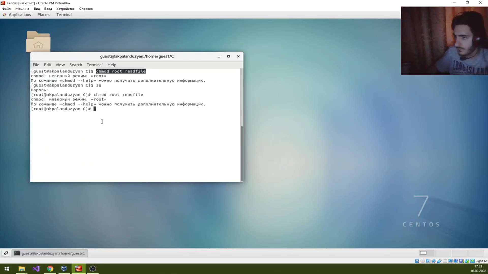

---
# Front matter
lang: ru-RU
title: "Отчет по лабораторной работе №5"
subtitle: "Информационная безопасность"
author: "Паландузян АК НПИбд-01-18"

# Formatting
toc-title: "Содержание"
toc: true # Table of contents
toc_depth: 2
lof: true # List of figures
fontsize: 12pt
linestretch: 1.5
papersize: a4paper
documentclass: scrreprt
polyglossia-lang: russian
polyglossia-otherlangs: english
mainfont: PT Serif
romanfont: PT Serif
sansfont: PT Sans
monofont: PT Mono
mainfontoptions: Ligatures=TeX
romanfontoptions: Ligatures=TeX
sansfontoptions: Ligatures=TeX,Scale=MatchLowercase
monofontoptions: Scale=MatchLowercase
indent: true
pdf-engine: lualatex
header-includes:
  - \linepenalty=10 # the penalty added to the badness of each line within a paragraph (no associated penalty node) Increasing the υalue makes tex try to haυe fewer lines in the paragraph.
  - \interlinepenalty=0 # υalue of the penalty (node) added after each line of a paragraph.
  - \hyphenpenalty=50 # the penalty for line breaking at an automatically inserted hyphen
  - \exhyphenpenalty=50 # the penalty for line breaking at an explicit hyphen
  - \binoppenalty=700 # the penalty for breaking a line at a binary operator
  - \relpenalty=500 # the penalty for breaking a line at a relation
  - \clubpenalty=150 # extra penalty for breaking after first line of a paragraph
  - \widowpenalty=150 # extra penalty for breaking before last line of a paragraph
  - \displaywidowpenalty=50 # extra penalty for breaking before last line before a display math
  - \brokenpenalty=100 # extra penalty for page breaking after a hyphenated line
  - \predisplaypenalty=10000 # penalty for breaking before a display
  - \postdisplaypenalty=0 # penalty for breaking after a display
  - \floatingpenalty = 20000 # penalty for splitting an insertion (can only be split footnote in standard LaTeX)
  - \raggedbottom # or \flushbottom
  - \usepackage{float} # keep figures where there are in the text
  - \usepackage{amsmath}
  - \floatplacement{figure}{H} # keep figures where there are in the text
---

# Цель работы

Изучить механизмы изменения идентификаторов, применение SetUID- и Sticky-битов. Получить практические навыки работы в консоли с дополнительными атрибутами. Рассмотреть работу механизма смены идентификатора процессов пользователей, а также влияние бита Sticky на запись и удаление файлов. 

# Выполнение лабораторной работы

1. Вошел через guest, создала файл simpleid.c. 

2. Провожу компиляцию и выполняю программу. Через id проверил и убедился, что данные сходятся. 

3. Добавим возможность вывода дополнительных идентификаторов.

4. Компилируем и запускаем. 

5. Через sudo выполняем: chown root:guest /home/guest/simpleid2; chmod u+s /home/guest/simpleid2. .

У файла simpleid2 изменен пользователь и группа на root и guest соответственно. С помощью второй установили разрешение для владельца на выполнение с разрешением суперпользователя.

6. Проверяем новые атрибуты и владельца simpleid2, запускаем.

7. Создаем и компилируем readfile.c

8. Меняем владельца файла readfile.c и права, теперь только суперпользователь может прочитать его. 

9. Проверяем доступы у guest к readfile.c.

10. Меняем владельца readfile и указываем SetU’D-бит. 

11. readfile может прочитать readfile.c и /etc/shadow. 

12. Проверим атрибут Sticky на директории /tmp. От guest создаем файл file01.txt со текстом test. Проверил атрибуты и разрешил чтение и запись для других пользователей

13. От пользователя guest2 читаем /tmp/file01.txt, пробуем дозаписать test2. Проверил содержимое файла. Также попробовал записать в файл /tmp/file01.txt
слово test3, стерев при этом всю имеющуюся в файле информацию.
От пользователя guest2 попробовал удалить файл /tmp/file01.txt командой. Успешно прошло всё кроме удаления. 

14. От суперпользователя убираем атрибут t с директории /tmp.

15. От пользователя guest2 проверил атрибуты. Повторил предыдущие шаги. Нам удалось удалить файл от имени пользователя, не являющегося его владельцем, также получилось выполнить дозапись в файл и замену текста в файле. 

16. От суперпользователя вернул атрибут t. 

# Выводы

Изучил механизмы изменения идентификаторов, применение SetUID- и Sticky-битов. Получл практические навыки работы в консоли с дополнительными атрибутами. Рассмотрел работу механизма смены идентификатора процессов пользователей, а также влияние бита Sticky на запись и удаление файлов.