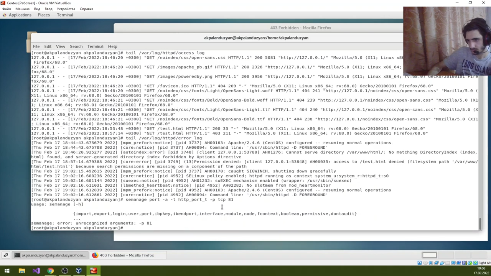
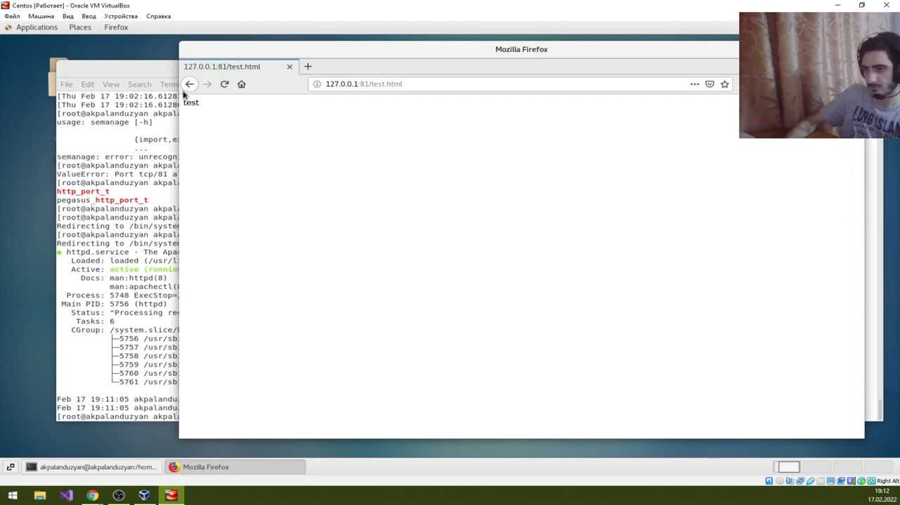

---
# Front matter
lang: ru-RU
title: "Отчет по лабораторной работе №6"
subtitle: "Информационная безопасность"
author: "Паландузян АК НПИбд-01-18"

# Formatting
toc-title: "Содержание"
toc: true # Table of contents
toc_depth: 2
lof: true # List of figures
fontsize: 12pt
linestretch: 1.5
papersize: a4paper
documentclass: scrreprt
polyglossia-lang: russian
polyglossia-otherlangs: english
mainfont: PT Serif
romanfont: PT Serif
sansfont: PT Sans
monofont: PT Mono
mainfontoptions: Ligatures=TeX
romanfontoptions: Ligatures=TeX
sansfontoptions: Ligatures=TeX,Scale=MatchLowercase
monofontoptions: Scale=MatchLowercase
indent: true
pdf-engine: lualatex
header-includes:
  - \linepenalty=10 # the penalty added to the badness of each line within a paragraph (no associated penalty node) Increasing the υalue makes tex try to haυe fewer lines in the paragraph.
  - \interlinepenalty=0 # υalue of the penalty (node) added after each line of a paragraph.
  - \hyphenpenalty=50 # the penalty for line breaking at an automatically inserted hyphen
  - \exhyphenpenalty=50 # the penalty for line breaking at an explicit hyphen
  - \binoppenalty=700 # the penalty for breaking a line at a binary operator
  - \relpenalty=500 # the penalty for breaking a line at a relation
  - \clubpenalty=150 # extra penalty for breaking after first line of a paragraph
  - \widowpenalty=150 # extra penalty for breaking before last line of a paragraph
  - \displaywidowpenalty=50 # extra penalty for breaking before last line before a display math
  - \brokenpenalty=100 # extra penalty for page breaking after a hyphenated line
  - \predisplaypenalty=10000 # penalty for breaking before a display
  - \postdisplaypenalty=0 # penalty for breaking after a display
  - \floatingpenalty = 20000 # penalty for splitting an insertion (can only be split footnote in standard LaTeX)
  - \raggedbottom # or \flushbottom
  - \usepackage{float} # keep figures where there are in the text
  - \usepackage{amsmath}
  - \floatplacement{figure}{H} # keep figures where there are in the text
---

# Цель работы

Развить навыки администрирования ОС Linux. Получить первое практическое знакомство с технологией SELinux. Проверить работу SELinx на практике совместно с веб-сервером Apache.

# Выполнение лабораторной работы

1. Проверил, что SELinux работает в режиме enforcing политики targeted. 

2. Проверил работу сервера.

3. Нашел Apache в списке процессов. 

4. Проверил переключатели SELinux для Apache. Многие из них находятся в положении «off».

5. Вывел статистику и определил множество пользователей, ролей и типов. Прооверил тип файлов поддиректориях. Определил круг пользователей, которым разрешено создание файлов в директории /var/www/html.

6. Создал файл test.html. 

7. Проверил контекст файла: httpd_sys_content_t 

8. Открыл файл через сервер. Всё прошло успешно. 

9. Меняю контекст файла test.html и проверяю его изменение. При подключении через сервер выдает ошибку.

12. Файл не был отображён из-за контекста файла. Проверил логи. 

13. Попробовал запустить веб-сервер Apache на прослушивание ТСР-порта 81.

14. Проанализиировал лог-файлы.

15. Выполнил команду: semanage port -a -t http_port_t -р tcp 81. После этого проверил список портов и увидел порт 81 в списке.

16. Вернул контекст httpd_sys_cоntent__t к файлу test.html, файл снова отображается при подключении через сервер.

17. Исправил конфигурационный файл, вернув Listen 80.

18. Удалил привязку http_port_t к 81 порту.

19. Удалил файл /var/www/html/test.html.

# Выводы
Развил навыки администрирования ОС Linux. Получил первое практическое знакомство с технологией SELinux. Проверил работу SELinx на практике совместно с веб-сервером Apache.