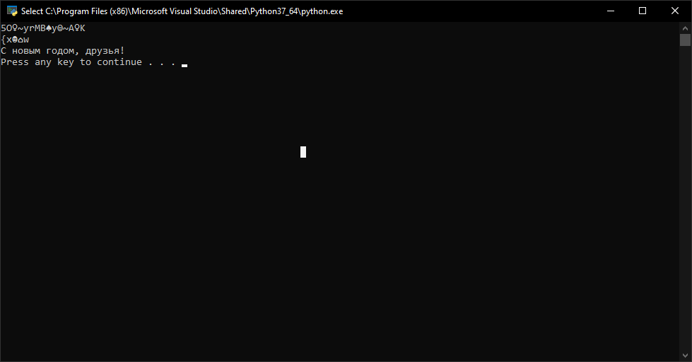

---
# Front matter
lang: ru-RU
title: "Отчет по лабораторной работе №7"
subtitle: "Информационная безопасность"
author: "Паландузян АК НПИбд-01-18"

# Formatting
toc-title: "Содержание"
toc: true # Table of contents
toc_depth: 2
lof: true # List of figures
fontsize: 12pt
linestretch: 1.5
papersize: a4paper
documentclass: scrreprt
polyglossia-lang: russian
polyglossia-otherlangs: english
mainfont: PT Serif
romanfont: PT Serif
sansfont: PT Sans
monofont: PT Mono
mainfontoptions: Ligatures=TeX
romanfontoptions: Ligatures=TeX
sansfontoptions: Ligatures=TeX,Scale=MatchLowercase
monofontoptions: Scale=MatchLowercase
indent: true
pdf-engine: lualatex
header-includes:
  - \linepenalty=10 # the penalty added to the badness of each line within a paragraph (no associated penalty node) Increasing the υalue makes tex try to haυe fewer lines in the paragraph.
  - \interlinepenalty=0 # υalue of the penalty (node) added after each line of a paragraph.
  - \hyphenpenalty=50 # the penalty for line breaking at an automatically inserted hyphen
  - \exhyphenpenalty=50 # the penalty for line breaking at an explicit hyphen
  - \binoppenalty=700 # the penalty for breaking a line at a binary operator
  - \relpenalty=500 # the penalty for breaking a line at a relation
  - \clubpenalty=150 # extra penalty for breaking after first line of a paragraph
  - \widowpenalty=150 # extra penalty for breaking before last line of a paragraph
  - \displaywidowpenalty=50 # extra penalty for breaking before last line before a display math
  - \brokenpenalty=100 # extra penalty for page breaking after a hyphenated line
  - \predisplaypenalty=10000 # penalty for breaking before a display
  - \postdisplaypenalty=0 # penalty for breaking after a display
  - \floatingpenalty = 20000 # penalty for splitting an insertion (can only be split footnote in standard LaTeX)
  - \raggedbottom # or \flushbottom
  - \usepackage{float} # keep figures where there are in the text
  - \usepackage{amsmath}
  - \floatplacement{figure}{H} # keep figures where there are in the text
---

# Цель работы

Освоить на практике применение режима однократного гаммирования.

# Выполнение лабораторной работы

Разработаем приложение с возможность гаммирования на Python:

```
text = 'С новым годом, друзья!'
key = 'Добрый вечер, коллеги!'

res1 = ''
res1 = res1.join(chr(ord(i) ^ ord(j)) for i, j in zip(text, key))
print(res1)

res2 = ''
res2 = res2.join(chr(ord(i) ^ ord(j)) for i, j in zip(key, res1))
print(res2)
```
1. В начале объявим переменные ключа и текста

2. Затем применим алгоритм гаммирования и запишем результат в res1. Выводим его. Это шифротекст.

3. Таким же образом, но с переменной res2, гаммируем шифротекст с ключом, чтобы получить текст.

4. Аналогично можно выполнить гаммирование текста по шифторексту, в этом случае получим ключ.

5. Вывод программы:



# Контрольные вопросы

1. Поясните смысл однократного гаммирования.
Каждый символ текста и ключа попарно побитово складываются по XOR.

2. Перечислите недостатки однократного гаммирования.
Ключ нельзя использовать повторно, при этом также имеется ограничение по символам, ведь размер ключа должен быть равен размеру текста.

3. Перечислите преимущества однократного гаммирования.
Симметричность алгоритма и криптостойкость. 

4. Почему длина открытого текста должна совпадать с длиной ключа?
Каждый символ текста должен попарно складываться с символом ключа, а это невозможно в случае, если количество символов разное — будут символы, к которым нет пары.

5. Какая операция используется в режиме однократного гаммирования, назовите её особенности?
Сложение по модулю 2 (XOR): при сложении чисел с другим получается исходное. Если в методе шифрования используется однократная вероятностная гамма той же длины, что и подлежащий сокрытию текст, то текст нельзя раскрыть.

6. Как по открытому тексту и ключу получить шифротекст?
Сложить попарно символы текста с ключом по модулю 2.

7. Как по открытому тексту и шифротексту получить ключ?
Сложить попарно по модулю 2 символы открытого текста с символами шифротекста.

8. В чём заключаются необходимые и достаточные условия абсолютной стойкости шифра?
- Полная случайность ключа
- Равенство длин ключа и открытого текста
- Использование ключа однократно


# Выводы

Освоил на практике применение режима однократного гаммирования.