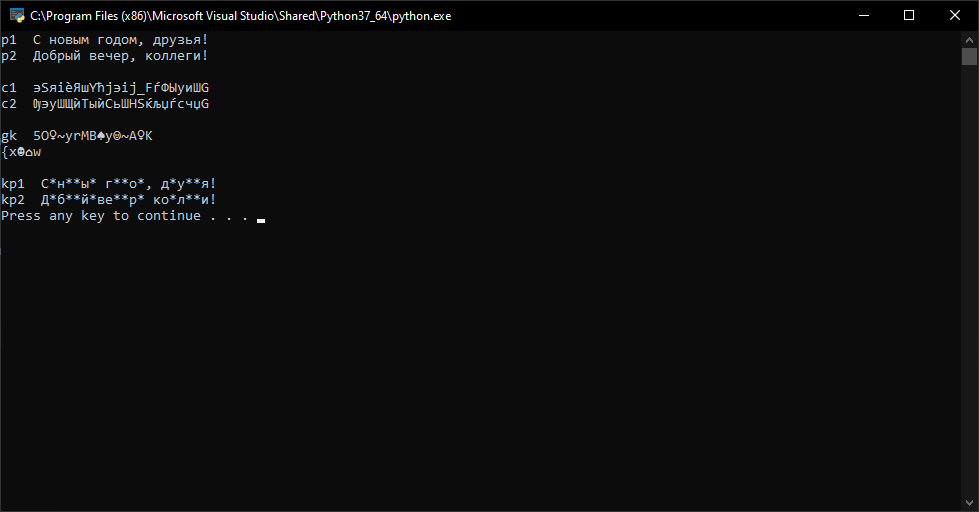

---
# Front matter
lang: ru-RU
title: "Отчет по лабораторной работе №8"
subtitle: "Информационная безопасность"
author: "Паландузян АК НПИбд-01-18"

# Formatting
toc-title: "Содержание"
toc: true # Table of contents
toc_depth: 2
lof: true # List of figures
fontsize: 12pt
linestretch: 1.5
papersize: a4paper
documentclass: scrreprt
polyglossia-lang: russian
polyglossia-otherlangs: english
mainfont: PT Serif
romanfont: PT Serif
sansfont: PT Sans
monofont: PT Mono
mainfontoptions: Ligatures=TeX
romanfontoptions: Ligatures=TeX
sansfontoptions: Ligatures=TeX,Scale=MatchLowercase
monofontoptions: Scale=MatchLowercase
indent: true
pdf-engine: lualatex
header-includes:
  - \linepenalty=10 # the penalty added to the badness of each line within a paragraph (no associated penalty node) Increasing the υalue makes tex try to haυe fewer lines in the paragraph.
  - \interlinepenalty=0 # υalue of the penalty (node) added after each line of a paragraph.
  - \hyphenpenalty=50 # the penalty for line breaking at an automatically inserted hyphen
  - \exhyphenpenalty=50 # the penalty for line breaking at an explicit hyphen
  - \binoppenalty=700 # the penalty for breaking a line at a binary operator
  - \relpenalty=500 # the penalty for breaking a line at a relation
  - \clubpenalty=150 # extra penalty for breaking after first line of a paragraph
  - \widowpenalty=150 # extra penalty for breaking before last line of a paragraph
  - \displaywidowpenalty=50 # extra penalty for breaking before last line before a display math
  - \brokenpenalty=100 # extra penalty for page breaking after a hyphenated line
  - \predisplaypenalty=10000 # penalty for breaking before a display
  - \postdisplaypenalty=0 # penalty for breaking after a display
  - \floatingpenalty = 20000 # penalty for splitting an insertion (can only be split footnote in standard LaTeX)
  - \raggedbottom # or \flushbottom
  - \usepackage{float} # keep figures where there are in the text
  - \usepackage{amsmath}
  - \floatplacement{figure}{H} # keep figures where there are in the text
---

# Цель работы

Освоить на практике применение режима однократного гаммирования на примере кодирования различных исходных текстов одним ключом.

# Выполнение лабораторной работы

1. Модернизируем код, написанный в предыдущей лабораторной работе:

```
p1 = 'С новым годом, друзья!'
p2 = 'Добрый вечер, коллеги!'
k  = 'lsrhbdtyhfyhdsfgdhttgf'
c1 = ''
c2 = ''

print('p1 ', p1)
print('p2 ', p2, '\n')

c1 = ''
c1 = c1.join(chr(ord(i) ^ ord(j)) for i, j in zip(p1, k))
print('c1 ', c1)
c2 = ''
c2 = c2.join(chr(ord(i) ^ ord(j)) for i, j in zip(p2, k))
print('c2 ', c2, '\n')

kp1 = 'С*н**ы* г**о*, д*у**я!'
kp2 = ''
gk = ''

gk = gk.join(chr(ord(i) ^ ord(j)) for i, j in zip(c1, c2))
print('gk ', gk, '\n')

kp2 = kp2.join('*' if i == '*' else chr(ord(i) ^ ord(j)) for i, j in zip(kp1, gk))
print('kp1 ', kp1)
print('kp2 ', kp2)
```

В переменных P запишем текст, в k - ключ, а в C - шифротекст.
kp1 - Известная часть первого текста
kp2 - Известная часть второго текста. Пока что она пустая, но в дальнейшем часть символов станет известна.
gk - ключ, получаемый при гаммировании двух шифротекстов, что равно гаммированию двух текстов.

2. Злоумышленнику известно kp1, c1 и c2. Для получения части kp2 злоумышленник гаммирует c1 и c2, получает gk. Затем он гаммирует kp1 по ключу gk, получает kp2. Часть символом из 1 и 2 текста всё ещё неизвестно, однако у злоумышленника есть возможность методом подстановки подобрать символы так, чтобы при гаммировании смысл обоих текстов не терялся. Таким образом можно сузить круг поиска, в некоторых случаях даже отыскать точные значения p1 и p2.

3. Вывод программы:




# Контрольные вопросы

1. Как, зная один из текстов ($P_1$ или $P_2$), определить другой, не зная при
этом ключа?  
$C_1 \oplus C_2 \oplus P_1 = P_1 \oplus P_2 \oplus P_1 = P_2$ 
 
2. Что будет при повторном использовании ключа при шифровании текста?  
Текст будет расшифрован.  

3. Как реализуется режим шифрования однократного гаммирования одним
ключом двух открытых текстов?  
По формулам режима однократного гаммирования:  
$$C_1 = P_1 \oplus K_1$$
$$C_2 = P_2 \oplus K_2$$
  
4. Перечислите недостатки шифрования одним ключом двух открытых
текстов.
- Ключ даст возможность расшифровать оба текста
- С помощью открытого текста можно расшифровать другие известные шифротексты
- Часть текста можно узнать, используя заранее известный шаблон и формат другого текста

5. Перечислите преимущества шифрования одним ключом двух открытых
текстов.
- Скорость шифрования
- Простота алгоритма
- Большие изменения шифротекста в случае изменения ключа или открытого текста


# Выводы

На основе проделанной работы освоила на практике применение режима однократного гаммирования на примере кодирования различных исходных текстов одним ключом.